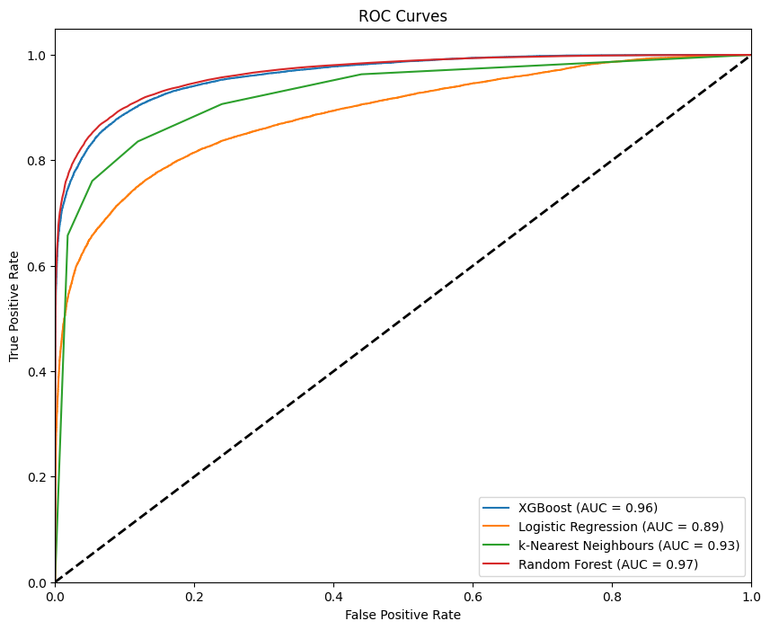
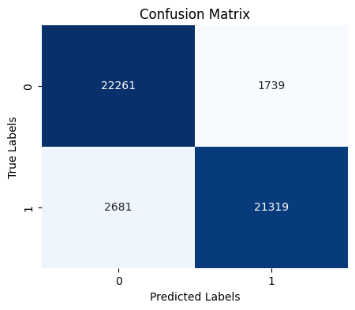
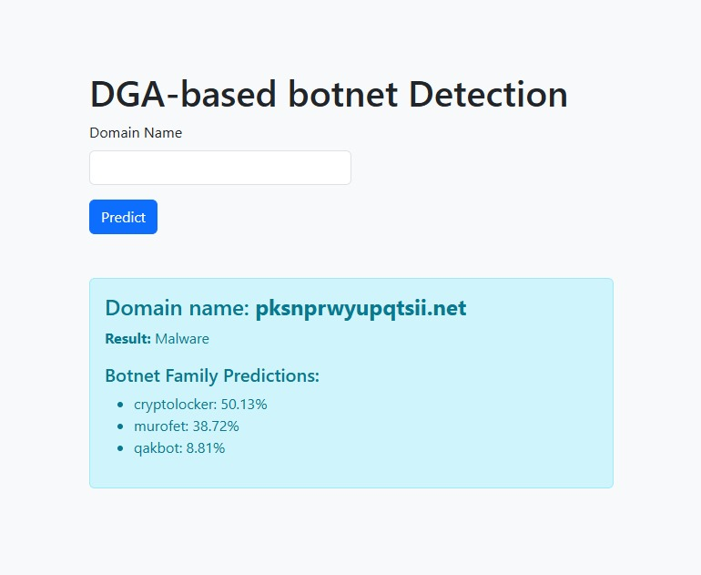

# DGA-Based Botnet Detection

## Overview
This project presents a two-stage system to detect and classify DGA (Domain Generation Algorithm)-based botnets using advanced Machine Learning (ML) and Deep Learning (DL) techniques. 


## Dataset
- Binary Classification dataset consisted of 240,000 labelled samples - 120k samples legitimate and 120k botnet-generated web domains(each botnet family consisting 2000 samples).
- Multi-class Classification dataset consisted og 240,000 labelled samples - each botnet family having 4000 samples each.

## Key Features
- **Two-Stage Detection System:**
  - Stage 1: Binary classification to distinguish botnet-generated web domains from legitimate ones.
  - Stage 2: Multi-class classification to identify the botnet family among **60+ classes**.

- **Feature Engineering and Machine Learning:**
  - Achieved **91% Accuracy and F1-score** with XGBoostClassifier.
  - Performed robust feature extraction methods(custom features + features from **N-GRAMS**), **enhancing detection accuracy by 15%**.
  - **Reduced False-Positives by 20%** by Hyperparameter Tuning XGBoostClassifier

- **Hybrid Deep Learning Model:**
  - Utilized Deep learning to classify botnet domains to 60 botnet families, achieving **86% accuracy and 0.4 loss**.
  - Developed a custom hybrid **CNN+Attention** architecture, resulting in a **10% boost in accuracy** and a **26% reduction in loss**.

- **Real-Time Prediction API:**
  - Developed a predict pipeline to streamline prediction of user input.
  - Deployed a **FastAPI** application for seamless and efficient real-time predictions.


### Installation
1. Clone the repository:
   ```bash
   git clone https://github.com/SathvikNayak123/detection_of_DGA_botnets.git
   ```
2. Install dependencies:
   ```bash
   pip install -r requirements.txt
   ```
3. Start the FastAPI application:
   ```bash
   uvicorn app.main:app --reload
   ```
## Results
- Binary Classification : 91% Accuracy and F1-score





- Multi-class Classification : 86% accuracy and 0.4 loss

## API interafce


